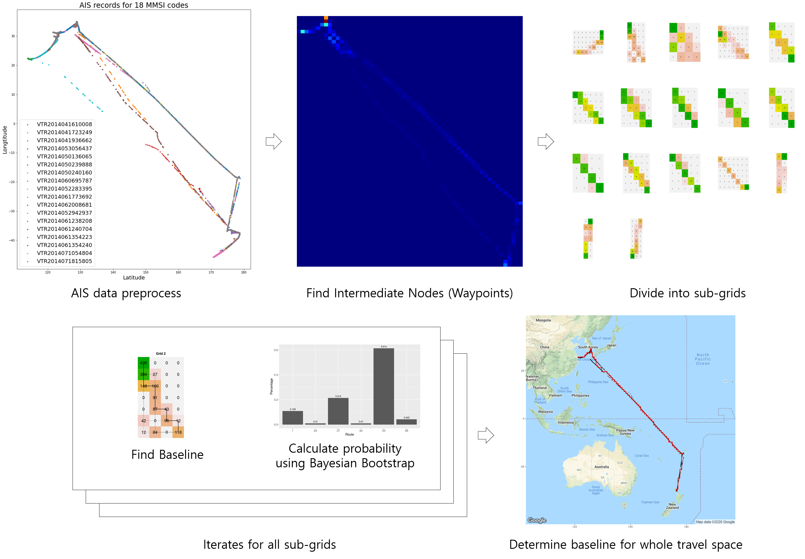

# [Maritime Logistics Anomaly Detection with Bootstrap Approach](https://yongkyung-oh.github.io/Bayesian_Bootstrap_for_AIS/)
(Working) YongKyung Oh and SungIl Kim, **Logistics Anomaly Detection With Maritime Big Data: A Bootstrap Approach**

Corresponding author: SungIl Kim (sungil.kim@unist.ac.kr)

## Abstract
To be updated

## Methodology Overview

