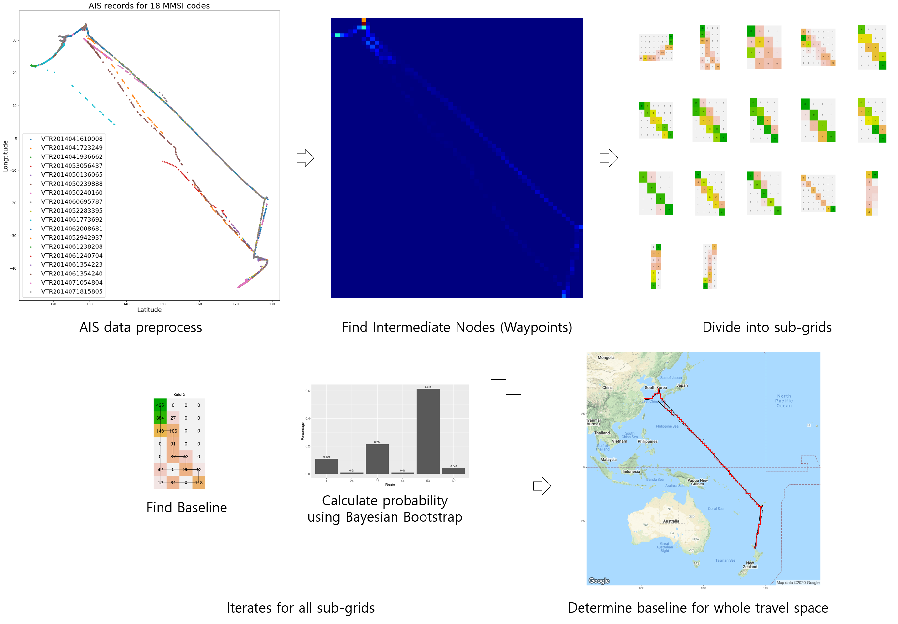

# Grid-Based Bayesian Bootstrap for AIS Anomaly Detection

Code and reproducibility materials for the paper:

**Grid-Based Bayesian Bootstrap Approach for Real-Time Detection of Abnormal Vessel Behaviors From AIS Data in Maritime Logistics**

YongKyung Oh and Sungil Kim, *IEEE Transactions on Automation Science and Engineering*, 21(4), 6680-6692, 2024.

- Paper: https://ieeexplore.ieee.org/document/10311542/
- DOI: https://doi.org/10.1109/TASE.2023.3329041
- Project page: https://yongkyung-oh.github.io/Bayesian_Bootstrap_for_AIS/
- Citation metadata: [`CITATION.cff`](CITATION.cff)
- License: [`MIT`](LICENSE)

## Abstract

Maritime logistics play an important role in the global economy. However, the uncertain and dynamic maritime environment presents challenges that hamper the achievement of proper situational awareness in route transportation. In the case of ocean transportation, detecting the anomalous behavior of vessels in such an unpredictable environment promotes the rapid achievement of successful situational awareness. To detect abnormal behavior of vessels, we propose a novel statistical anomaly detector in a grid-based structure. To overcome the drawback of the grid-based approach when the monitored area is large, we divide the monitored area into multiple grids by selecting intermediate cells. For each grid, the proposed method extracts a normal representation, called a baseline, from historical AIS data combined with bill-of-lading data. Bayesian bootstrap techniques are adopted to quantify any uncertainty in the baseline and to compute the probability that each route will be abnormal. Based on the computed probability, the proposed method enables real-time spatial and temporal maritime traffic monitoring. The effectiveness of the proposed method is evaluated using simulated data and real data from maritime logistics.

## Overview

This repository implements a grid-based Bayesian bootstrap approach for real-time detection of abnormal vessel behaviors from AIS data in maritime logistics. The method divides a monitored maritime area into grids, learns a baseline route representation from historical AIS and bill-of-lading data, and uses Bayesian bootstrap uncertainty quantification to estimate abnormal-route probabilities for spatial and temporal monitoring.

<p align="center">
  
</p>

## What This Repository Contains

| Path | Contents |
| --- | --- |
| [`functions.py`](functions.py) | Core Python helper functions for route/path computation and bootstrap-based analysis. |
| [`tutorial codes/`](tutorial%20codes/) | Tutorial notebooks and scripts for illustrative examples, simulation, computation checks, and comparison experiments. |
| [`real_data codes/`](real_data%20codes/) | Notebooks, scripts, and figures for the real-data maritime logistics case study. |
| [`overview.png`](overview.png) | High-level methodology figure used in the project page and README. |
| [`CITATION.cff`](CITATION.cff) | Machine-readable citation metadata for GitHub's "Cite this repository" panel. |

## Research Problem

Maritime logistics data are dynamic, uncertain, and spatially structured. Vessel routes can vary for legitimate operational reasons, which makes abnormal behavior detection difficult when using fixed route templates or deterministic baselines.

The proposed method addresses this by:

- representing monitored vessel movement in a grid-based route structure,
- extracting a normal baseline from historical movement patterns,
- quantifying baseline uncertainty with Bayesian bootstrap sampling,
- estimating route-level abnormality probabilities in real time,
- supporting large monitored areas through intermediate-cell grid decomposition.

## Repository Workflow

The repository is organized around two use cases:

1. **Tutorial and simulation examples**
   - Start with notebooks under [`tutorial codes/`](tutorial%20codes/).
   - Use these files to inspect the route representation and bootstrap computation on controlled examples.

2. **Real-data case study**
   - See [`real_data codes/`](real_data%20codes/) for preprocessing, baseline construction, grid analysis, and visualization materials used for the maritime logistics case study.

The notebooks and scripts use Python and R. Exact environment files are not currently provided, so inspect the imports in each notebook/script before running the full workflow.

## Citation

If you use this repository, method, or project materials, please cite the published paper:

```bibtex
@article{oh2024grid,
  title   = {Grid-Based Bayesian Bootstrap Approach for Real-Time Detection of Abnormal Vessel Behaviors From AIS Data in Maritime Logistics},
  author  = {Oh, YongKyung and Kim, Sungil},
  journal = {IEEE Transactions on Automation Science and Engineering},
  volume  = {21},
  number  = {4},
  pages   = {6680--6692},
  year    = {2024},
  doi     = {10.1109/TASE.2023.3329041}
}
```

GitHub-compatible citation metadata is also available in [`CITATION.cff`](CITATION.cff).

## Note To Practitioners

<details>
<summary><b>Show practitioner note</b></summary>

Maritime logistics is a crucial aspect of the global economy, but the unpredictable and dynamic maritime environment poses challenges for situational awareness during transportation. Detecting abnormal behavior of vessels in ocean transportation can significantly contribute to achieving situational awareness. To address this challenge, this work presents a statistical anomaly detector in a grid-based structure. The monitored area is divided into multiple grids, and a normal representation, called a baseline, is extracted for each grid from historical AIS data combined with bill-of-lading data. The proposed method enables real-time spatial and temporal maritime traffic monitoring and is especially relevant for large monitored areas.

</details>

## Contact

For questions about the paper, contact the corresponding author:

- Sungil Kim: sungil.kim@unist.ac.kr
