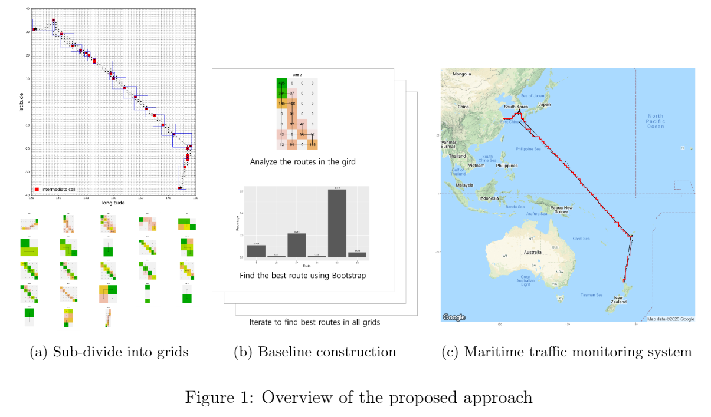

# [Grid-Based Bayesian Bootstrap Approach for Real-Time Detection of Abnormal Vessel Behaviors From AIS Data in Maritime Logistics](https://yongkyung-oh.github.io/Bayesian_Bootstrap_for_AIS/)
Oh, Y., & Kim, S. (2023). Grid-Based Bayesian Bootstrap Approach for Real-Time Detection of Abnormal Vessel Behaviors From AIS Data in Maritime Logistics. IEEE Transactions on Automation Science and Engineering. doi: [10.1109/TASE.2023.3329041](https://ieeexplore.ieee.org/document/10311542).

Corresponding author: SungIl Kim (sungil.kim@unist.ac.kr)

## Abstract
Maritime logistics play an important role in the global economy. However, the uncertain and dynamic maritime environment presents challenges that hamper the achievement of proper situational awareness in route transportation. In the case of ocean transportation, detecting the anomalous behavior of vessels in such an unpredictable environment promotes the rapid achievement of successful situational awareness. To detect abnormal behavior of vessels, we propose a novel statistical anomaly detector in a grid-based structure. To overcome the drawback of the grid-based approach when the monitored area is large, we divide the monitored area into multiple grids by selecting intermediate cells. For each grid, the proposed method extracts a normal representation, called a baseline, from historical AIS data combined with bill-of-lading data. Bayesian bootstrap techniques are adopted to quantify any uncertainty in the baseline and to compute the probability that each route will be abnormal. Based on the computed probability, the proposed method enables real-time spatial and temporal maritime traffic monitoring. The effectiveness of the proposed method is evaluated using simulated data and real data from maritime logistics.

## Note to Practitioners
Maritime logistics is a crucial aspect of the global economy, but the unpredictable and dynamic maritime environment poses challenges for situational awareness during transportation. Detecting abnormal behavior of vessels in ocean transportation can significantly contribute to achieving situational awareness. To address this challenge, we present a new statistical anomaly detector in a grid-based structure. We divided the monitored area into multiple grids and extracted a normal representation, called a baseline, for each grid from historical AIS data combined with bill-of-lading data. The proposed method enables real-time spatial and temporal maritime traffic monitoring, which is especially effective for large monitored areas. The effectiveness of the proposed method is evaluated using simulated data and real data from maritime logistics, making it practical for the industry.

## Methodology Overview

  

 
